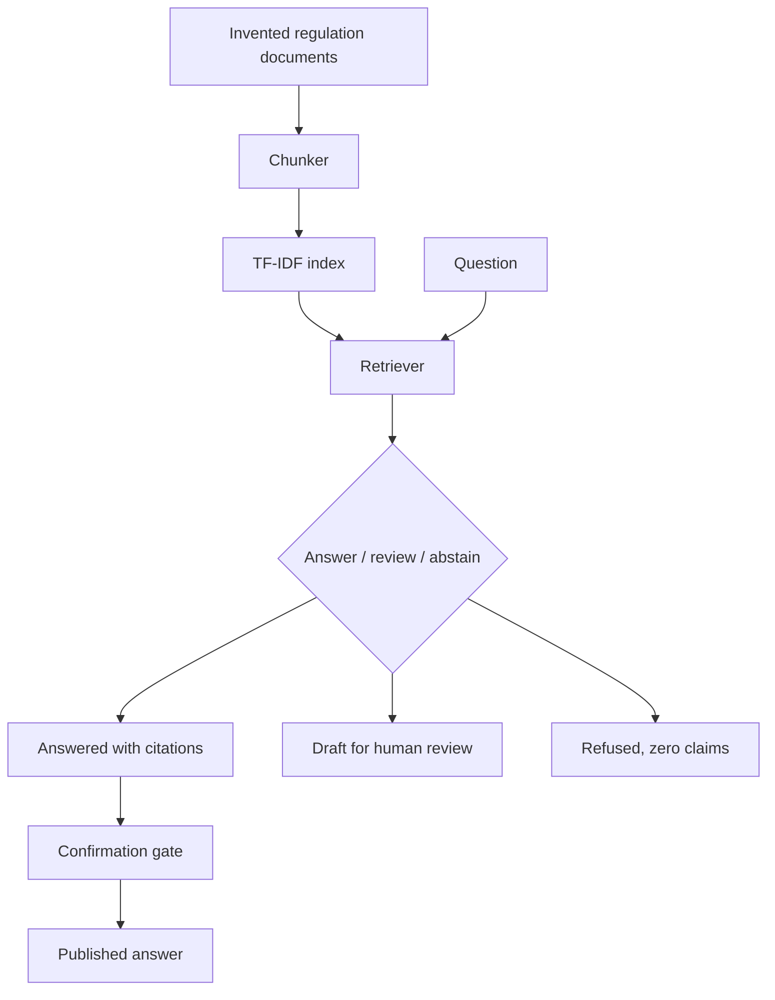

# Knowledge — architecture (Mermaid)

```mermaid
flowchart TD
    Docs[Invented regulation documents] --> Chunker[Chunker]
    Chunker --> Index[TF-IDF index]
    Index --> Retriever[Retriever]
    Q[Question] --> Retriever
    Retriever --> Boundary{Answer / review / abstain}
    Boundary --> Answered[Answered with citations]
    Boundary --> Review[Draft for human review]
    Boundary --> Abstain[Refused, zero claims]
    Answered --> Gate[Confirmation gate]
    Gate --> Out[Published answer]
```

See `docs/architecture.md` for the fuller diagram and the reasoning
behind the trust boundary's placement.
